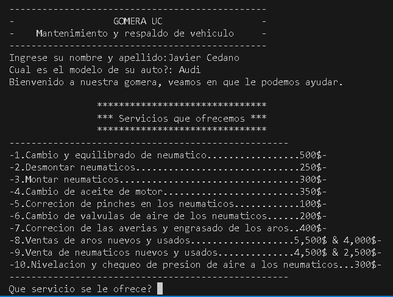
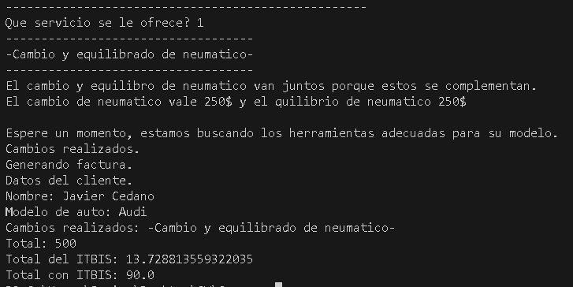

# Gomera-Python
Servicios de gomera en terminal.
Programa de terminal creado en con el lenguaje pyton.
Consiste en la facturacion de servicios realizados a un cliente, que debe proveer su nombre y su modelo de vehiculo,para posteriormente mostrarle los servicios que se ofrecen y elegir el que desee, una vez todo este hecho, genera una factura completa
incluyendo claramente su respectivo ITBIS.

